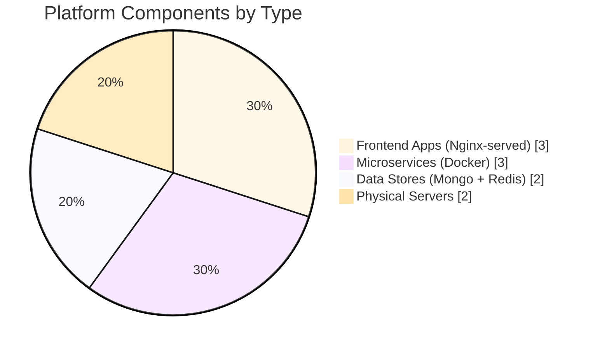
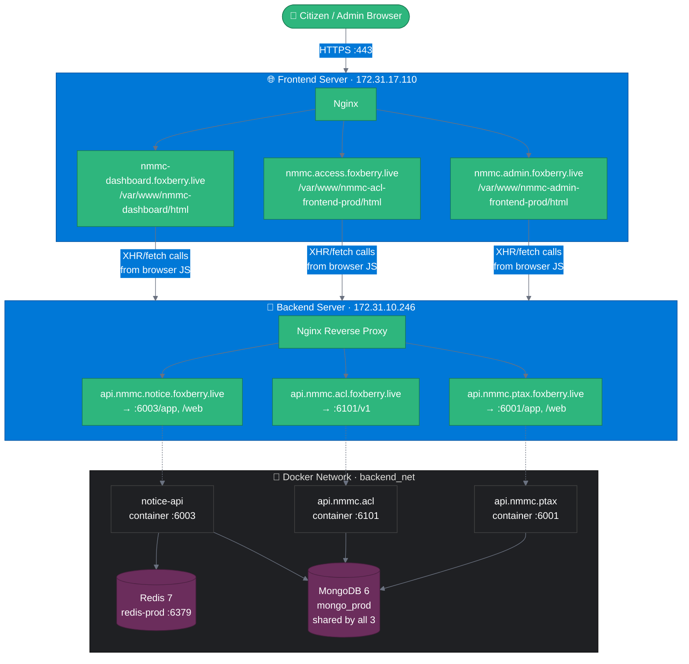
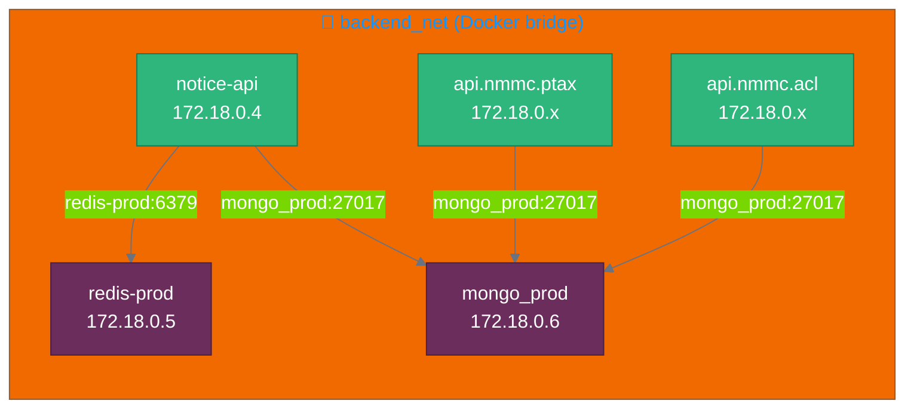
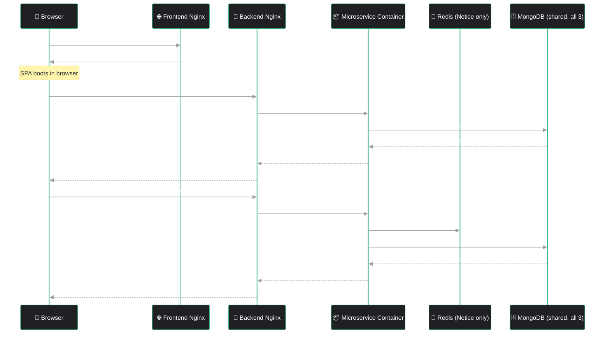
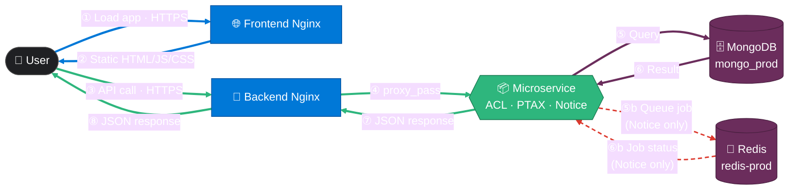
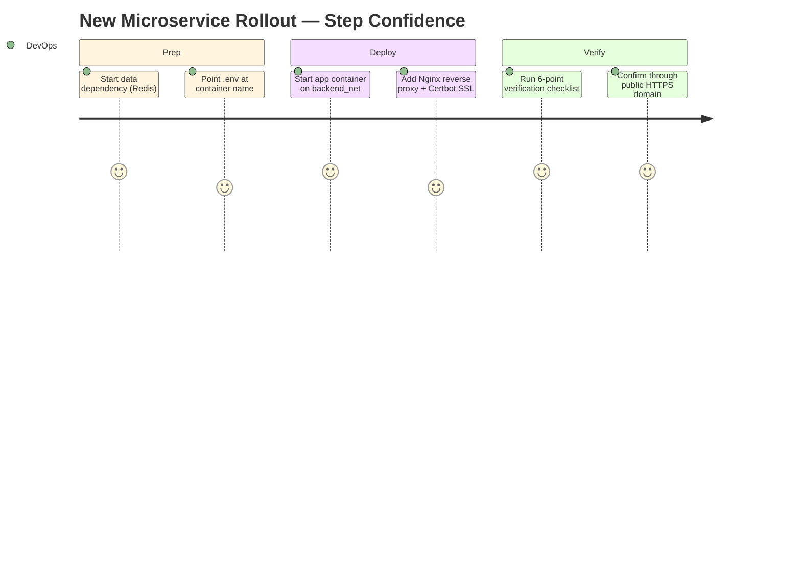

<div align="center">

# 🏛️ NMMC Production Platform — System Architecture

### Municipal Corporation Digital Services — Frontend, Microservices & Data Layer


**Three frontends. Three microservices. Two servers. One dashboard.**

<br/>


</div>

> 📌 **Scope note:** this document is built from the actual Nginx configs, running container list, and verified Redis/Mongo connectivity checks for this environment. **All three microservices — ACL, PTAX, and Notice — are confirmed to connect to the same MongoDB instance (`mongo_prod`).** Redis remains Notice-service-only, used for its queue/job layer.

---

## 📑 Table of Contents

- [🎯 What This Platform Is](#-what-this-platform-is)
- [🎨 Design System — Reading This Document's Colors](#-design-system--reading-this-documents-colors)
- [🏗️ High-Level Architecture](#️-high-level-architecture)
- [🖥️ Server Topology](#️-server-topology)
- [🌐 Frontend Layer](#-frontend-layer)
- [🔌 Backend / API Layer](#-backend--api-layer)
- [📦 Microservices & Data Layer](#-microservices--data-layer)
- [🐳 Docker Network Deep-Dive](#-docker-network-deep-dive)
- [🎬 Request Lifecycle — Full Traffic Flow](#-request-lifecycle--full-traffic-flow)
- [🌈 Color-Coded Traffic Map](#-color-coded-traffic-map)
- [🔐 TLS / SSL](#-tls--ssl)
- [➕ Deploying a New Microservice — Runbook](#-deploying-a-new-microservice--runbook)
- [✅ Production Verification Checklist](#-production-verification-checklist)
- [⚠️ Known Warnings & Tech Debt](#️-known-warnings--tech-debt)
- [🛡️ Security Notes](#️-security-notes)

---

## 🎯 What This Platform Is

NMMC (municipal corporation) runs **three public-facing frontend applications**, each backed by its **own dedicated microservice**, sharing a common infrastructure pattern: static frontends on one server, containerized APIs behind Nginx on a second server, with each microservice owning its own data store.

| Frontend App | Talks to Microservice | Purpose |
|---|---|---|
| 📊 NMMC Dashboard | Aggregates all three | Unified citizen/admin dashboard |
| 🔐 Access Control | `api.nmmc.acl` | Authentication / authorization / user management |
| 🛠️ Admin Portal | `api.nmmc.ptax` + `api.nmmc.acl` | Property tax administration |
| 📨 (Notices, via dashboard) | `api.nmmc.notice` | Notice generation/delivery, queue-backed |

---

## 🎨 Design System — Reading This Document's Colors

Every diagram in this document uses the **same five-color language**, consistently, so you can read any diagram without re-learning a new legend each time:

<div align="center">


-6B2D5C?style=for-the-badge)
-DC382D?style=for-the-badge)


</div>

| Color | Always represents |
|---|---|
| 🔵 **Blue** (`#0078D7`) | Servers, Nginx, reverse proxies — the "plumbing" layer |
| 🟢 **Green** (`#2EB67D`) | Microservices and API-level request/response traffic |
| 🟣 **Purple** (`#6B2D5C`) | MongoDB — the shared persistent data layer |
| 🔴 **Red, dashed** (`#DC382D`) | Redis — async/queue traffic, visually distinct as *not* a direct request/response |
| ⬛ **Dark neutral** (`#1F2023`) | End users, browsers, and generic containers |

Once you've seen this table once, every diagram below is self-explanatory by color alone.

### 📊 System Composition at a Glance



> This is a **component count**, not traffic or usage volume — no live metrics were available to chart, so nothing here implies which service gets the most requests.

---

## 🏗️ High-Level Architecture



**Two physical layers, one clean separation of concerns:**
- **Frontend server** only ever serves static files — no application logic, no database access.
- **Backend server** only ever proxies to Docker containers — Nginx here never touches a filesystem beyond SSL certs.

---

## 🖥️ Server Topology

<div align="center">

| Server | Private IP | Role | Exposes |
|---|---|---|---|
| **Frontend Server** | `172.31.17.110` | Static SPA hosting via Nginx | 3 public domains (dashboard, access, admin) |
| **Backend / API Server** | `172.31.10.246` | Nginx reverse proxy + Docker host | 3 public API domains, all Docker containers |

</div>

> Both IPs fall in the `172.31.x.x` private range typical of an AWS default VPC — these are internal addresses, with public traffic reaching them via their respective domain names over HTTPS.

---

## 🌐 Frontend Layer

Three independent single-page applications, each served as static files with client-side routing fallback:

<div align="center">

| Domain | Deploy Path | SPA Fallback |
|---|---|---|
| `nmmc-dashboard.foxberry.live` | `/var/www/nmmc-dashboard/html` | `try_files $uri $uri/ /index.html` |
| `nmmc.access.foxberry.live` | `/var/www/nmmc-acl-frontend-prod/html` | `try_files $uri $uri/ /index.html` |
| `nmmc.admin.foxberry.live` | `/var/www/nmmc-admin-frontend-prod/html` | `try_files $uri $uri/ /index.html` |

</div>

**Shared configuration pattern across all three:**
- All traffic forced to HTTPS via a `listen 80` block that 301-redirects to `https://$host$request_uri` (Certbot-managed)
- TLS via Let's Encrypt (`fullchain.pem` / `privkey.pem` per domain, shared `ssl-dhparams.pem`)
- The dashboard site additionally caches static assets (`js|css|png|jpg|jpeg|gif|svg|ico|woff|woff2|ttf`) for 30 days with `access_log off` — worth replicating on the other two sites for consistency, since they don't currently have this optimization.

---

## 🔌 Backend / API Layer

<div align="center">

| Public API Domain | Proxies To | Container Port | Path(s) |
|---|---|---|---|
| `api.nmmc.acl.foxberry.live` | `api.nmmc.acl` container | `6101` | `/v1` |
| `api.nmmc.notice.foxberry.live` | `notice-api` container | `6003` | `/app`, `/web` |
| `api.nmmc.ptax.foxberry.live` | `api.nmmc.ptax.foxberry.live` container | `6001` | `/app`, `/web` |

</div>

**Notable difference:** the `notice` proxy block explicitly forwards `Host`, `X-Real-IP`, `X-Forwarded-For`, and `X-Forwarded-Proto` headers — the `acl` and `ptax` blocks currently don't. Since Notice is the service actually reading client IPs / protocol for correct behavior behind a proxy, this is likely intentional, but worth confirming whether ACL/PTAX also need these headers (e.g. for request logging or rate-limiting by IP).

---

## 📦 Microservices & Data Layer

<div align="center">

| Container | Image | Port | Network | Backing Data Store |
|---|---|---|---|---|
| `notice-api` | `api.nmmc.notice:v1` | `6003` | `backend_net` | **MongoDB** (`mongo_prod`) + **Redis** (`redis-prod`) |
| `api.nmmc.ptax.foxberry.live` | *(same name)* | `6001` | `backend_net` | **MongoDB** (`mongo_prod`) |
| `api.nmmc.acl.foxberry.live` | *(same name)* | `6101` | `backend_net` | **MongoDB** (`mongo_prod`) |
| `redis-prod` | `redis:7-alpine` | `6379` | `backend_net` | — (Notice service only) |
| `mongo_prod` | `mongo:6` | `27018→27017` (127.0.0.1 only) | `backend_net` | — (shared by all 3 services) |

</div>

> ✅ **Resolved:** an earlier `docker ps` snapshot from this host had also shown a `mysql-prod` container, which briefly raised the question of what backed PTAX/ACL. That's now settled — **all three microservices share the single `mongo_prod` instance**; `mysql-prod` was evidently decommissioned or migrated away and isn't part of the current data layer at all.

**Why Notice is still the odd one out:** all three services read/write the same MongoDB instance, but Notice is the only one with a queue/cache layer in front of it — Redis handles job state, MongoDB stores the actual notice documents.

> ⚠️ **Worth flagging for the team:** three independent services sharing one MongoDB instance means a single point of failure for all citizen-facing functionality if `mongo_prod` goes down, and raises a data-isolation question worth confirming — are ACL/PTAX/Notice using **separate databases within the same MongoDB instance** (`mongo_prod` can host multiple logical databases), or the same database/collections? The former is standard practice and low-risk; the latter would mean a schema or query bug in one service could touch another service's data. Worth a quick `show dbs` check to confirm which pattern is in use.

---

## 🐳 Docker Network Deep-Dive

All containers share a single Docker bridge network, `backend_net`, which gives Docker's built-in DNS resolver a name for every container — so services never hardcode IPs:



**Verified DNS resolution** (from an actual production check):
```bash
$ docker exec notice-api getent hosts redis-prod
172.22.0.5      redis-prod
```

This confirms the app never needs to know a container IP — it connects to `redis-prod:6379` and `mongo_prod:27017` by name, and Docker resolves them internally. `.env` values reflect this directly:
```env
REDIS_HOST=redis-prod
REDIS_PORT=6379
REDIS_PASSWORD=Foxberry@Redis6379
```

> ⚠️ **Common failure mode already hit in this environment:** if `.env` accidentally points to `REDIS_HOST=127.0.0.1` instead of `redis-prod`, the app fails with `connect ECONNREFUSED 127.0.0.1:6379` — because `127.0.0.1` *inside a container* refers to the container itself, not the host or Redis. Always use the container's Docker network name, never `localhost`, for inter-container calls.

---

## 🎬 Request Lifecycle — Full Traffic Flow



**Key property:** the browser only ever talks to two Nginx endpoints — the frontend domain for the app shell, and whichever `api.nmmc.*` domain the SPA calls for data. Docker networking, container names, and internal ports are completely invisible to the outside world.

---

## 🌈 Color-Coded Traffic Map

GitLab's Mermaid renderer doesn't run JavaScript, so nothing here is animated in the motion-graphic sense — but numbered steps plus distinct colors/line-styles per traffic *type* give the same at-a-glance "follow the flow" effect a real animation would, without depending on anything GitLab can't render natively.



<div align="center">

| Line style | Meaning | Steps |
|---|---|---|
| 🔵 **Blue, solid** | Static asset delivery (frontend) | ① ② |
| 🟢 **Green, solid** | API request/response over HTTPS | ③ ④ ⑦ ⑧ |
| 🟣 **Purple, solid** | MongoDB read/write (all 3 services) | ⑤ ⑥ |
| 🔴 **Red, dashed** | Async Redis queue operation (Notice only) | ⑤b ⑥b |

</div>

---

## 🔐 TLS / SSL

Every domain — frontend and API alike — is Certbot-managed with the identical pattern:

```nginx
listen 443 ssl;
ssl_certificate /etc/letsencrypt/live/<domain>/fullchain.pem;
ssl_certificate_key /etc/letsencrypt/live/<domain>/privkey.pem;
include /etc/letsencrypt/options-ssl-nginx.conf;
ssl_dhparam /etc/letsencrypt/ssl-dhparams.pem;
```

paired with a second `server{}` block on port 80 that force-redirects to HTTPS:
```nginx
server {
    if ($host = <domain>) {
        return 301 https://$host$request_uri;
    }
    listen 80;
    server_name <domain>;
    return 404;
}
```

Six domains total (3 frontend + 3 API) all follow this exact pattern — a strong sign this was set up systematically rather than ad-hoc, and a good template to copy verbatim for any 7th domain.

---

## ➕ Deploying a New Microservice — Runbook

This is the exact, proven sequence used to stand up the **Notice service + Redis** — generalized here so it applies to any future microservice.



> Scores (1–5) reflect how repeatable/low-risk each step is *given this exact runbook* — not a measurement of anything live. The dip at "point `.env` at container name" reflects the one mistake already made once in this environment (`127.0.0.1` instead of `redis-prod`) — see the callout in [Docker Network Deep-Dive](#-docker-network-deep-dive).

<details>
<summary><b>▶ Step 1 — Start the data dependency first (example: Redis)</b></summary>

```bash
sudo docker run -d \
  --name redis-prod \
  --restart unless-stopped \
  --network backend_net \
  -v redis_data:/data \
  -p 6379:6379 \
  redis:7-alpine \
  redis-server \
  --appendonly yes \
  --requirepass "Foxberry@Redis6379"
```
Key flags worth understanding:
- `--network backend_net` — puts it on the same Docker network as every other service, enabling name-based DNS resolution
- `-v redis_data:/data` — named volume, so data survives container restarts/recreation
- `--appendonly yes` — AOF persistence, so a Redis restart doesn't lose queued jobs
- `--requirepass` — never run production Redis without a password, even on an internal network

</details>

<details>
<summary><b>▶ Step 2 — Set the application's `.env` to the container name, never an IP or localhost</b></summary>

```env
REDIS_HOST=redis-prod
REDIS_PORT=6379
REDIS_PASSWORD=Foxberry@Redis6379
```
</details>

<details>
<summary><b>▶ Step 3 — Start the application container on the same network</b></summary>

```bash
sudo docker run -d \
  --name notice-api \
  --network backend_net \
  -p 6003:6003 \
  --env-file .env \
  --restart unless-stopped \
  api.nmmc.notice:v1
```
</details>

<details>
<summary><b>▶ Step 4 — Add the Nginx reverse proxy block + SSL</b></summary>

```nginx
server {
    server_name api.nmmc.<service>.foxberry.live;

    location /app {
        proxy_pass http://localhost:<port>/app;
        proxy_http_version 1.1;
        proxy_set_header Host $host;
        proxy_set_header X-Real-IP $remote_addr;
        proxy_set_header X-Forwarded-For $proxy_add_x_forwarded_for;
        proxy_set_header X-Forwarded-Proto $scheme;
    }

    listen 443 ssl;
    # ... standard Certbot SSL block (see TLS section above)
}
```
Then run `sudo certbot --nginx -d api.nmmc.<service>.foxberry.live` to provision the certificate and auto-configure the redirect block.

</details>

<details>
<summary><b>▶ Step 5 — Run the full verification checklist</b></summary>

See [✅ Production Verification Checklist](#-production-verification-checklist) below — every one of these was actually run against the Notice service before it was declared production-ready.

</details>

---

## ✅ Production Verification Checklist

<div align="center">

| # | Check | Command | Confirms |
|---|---|---|---|
| 1 | Containers on the same network | `sudo docker network inspect backend_net` | New container appears alongside existing services |
| 2 | Correct env vars loaded | `sudo docker exec <container> printenv \| grep REDIS` | `.env` used, not a fallback/hardcoded value |
| 3 | Docker DNS resolves the dependency | `sudo docker exec <container> getent hosts redis-prod` | Returns an internal IP, e.g. `172.22.0.5` |
| 4 | Application logs are clean | `sudo docker logs -f <container>` | No `ECONNREFUSED`, sees `✅ Redis Connected` |
| 5 | Dependency sees the connection | `docker exec -it redis-prod redis-cli` → `AUTH <pass>` → `CLIENT LIST` | Client IP from the Docker network appears |
| 6 | End-to-end through Nginx | `curl -vk https://api.nmmc.<service>.foxberry.live/web` | Real response, not `502 Bad Gateway` |

</div>

**Real verification run for the Notice service:**
```text
$ docker exec notice-api getent hosts redis-prod
172.22.0.5      redis-prod

$ docker logs notice-api
✅ Redis Connected
✅ Redis Connected
✅ Redis Connected
[server] running @ http://localhost:6003
```

> The `✅ Redis Connected` line appearing **three times** is expected, not a bug — it's Node.js cluster mode (1 master + 2 workers), and each worker opens its own Redis connection independently.

---

## ⚠️ Known Warnings & Tech Debt

None of these are currently breaking production, but they're worth scheduling cleanup for:

<div align="center">

| Priority | Warning | Where | Fix |
|---|---|---|---|
| 🟡 Medium | `Duplicate schema index` | Mongoose (Notice service) | Same index declared twice in a schema — remove the duplicate declaration |
| 🟢 Low | `useNewUrlParser` / `useUnifiedTopology` deprecated | MongoDB Node driver v4+ | Both options are default behavior now — safe to delete from the connection call |
| 🟠 Medium-High | `AWS SDK v2 has reached end-of-support` | Notice service | Plan a migration to AWS SDK v3 — v2 still works today but won't receive security patches |
| 🔴 High | Shared MongoDB isolation unconfirmed | ACL / PTAX / Notice | See the [data-isolation flag](#-microservices--data-layer) — confirm separate logical databases per service |

</div>

---

## 🛡️ Security Notes

- **MongoDB is bound to `127.0.0.1` only** (`127.0.0.1:27018→27017`) — it isn't reachable from outside the backend server at all, even before any firewall rule. All three application containers still reach it over the internal Docker network by container name (`mongo_prod`), which is independent of the host-port binding.
- **Three services share a single MongoDB instance** — confirm (via `show dbs` inside `mongo_prod`) that ACL, PTAX, and Notice each use their **own logical database**, not shared collections. Separate databases on one instance is standard and low-risk; shared collections across services is a data-isolation risk worth closing if found.
- **Redis requires a password** (`--requirepass`) even though it's already isolated on an internal Docker network — defense in depth in case the network boundary is ever misconfigured.
- **Frontend and backend are fully separated servers** — a compromise of the static-file frontend host has no direct path to application data, since it holds no database credentials or container access.
- **Every public domain terminates TLS via Let's Encrypt**, with plain-HTTP explicitly 301-redirected rather than served — no domain accepts unencrypted traffic.
